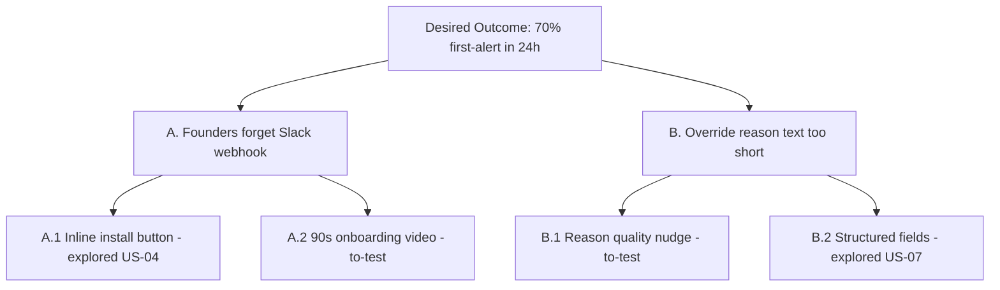

# Step 06 — OST (Opportunity Solution Tree)

**Goal:** produce `<out>/docs/ost.md` — a structured Opportunity Solution Tree (Teresa Torres, *Continuous Discovery Habits*) connecting the PRD's North Star Metric to user-problem opportunities to candidate solutions. Sibling artifact to PRD (not embedded).

**Mode:** `synthesis` with `delegable: true`. Sub-agent reads PRD + functional-spec interviews + concept-brief and produces the tree mechanically.

## Output

| File | Role | Floor | Ceiling |
|---|---|---|---|
| `<out>/docs/ost.md` | structured opportunity tree linking NSM → opportunities → solutions | 3 KB | 6 KB |

## Inputs (read first)

- `<out>/docs/prd/v1.md` § Success metrics (NSM slot) — the desired-outcome ROOT of the tree
- `<out>/docs/prd/v1.md` § User stories — context for what's already in scope
- `<out>/docs/functional-spec.md` § Problem-Validation Interviews — raw problem signal (3-5 summaries per Decision 6)
- `<out>/docs/concept-brief.md` § Mechanics + § Hook — persona context for inference fallback when interviews are thin
- Reference reading: Teresa Torres, [*Continuous Discovery Habits*](https://www.producttalk.org/2021/03/continuous-discovery-habits-by-teresa-torres-is-coming-soon-may-2021/) (book) or [Product Talk Academy intro](https://www.producttalk.org/opportunity-solution-tree/)

## Structure (standard tier)

```
1 Desired Outcome (root = NSM from PRD)
  ├── Opportunity A (user problem discovered/inferred)
  │     ├── Solution A.1 (status: explored / to-test / parked)
  │     ├── Solution A.2 (status)
  │     └── Solution A.3 (status, optional)
  ├── Opportunity B
  │     ├── Solution B.1
  │     └── Solution B.2
  ├── Opportunity C
  │     ├── Solution C.1
  │     └── ...
  ├── Opportunity D (optional)
  └── Opportunity E (optional)
```

### Required attributes

- **Desired Outcome (root)**: verbatim quote of PRD's NSM (e.g., "70% of new teams hit first-Slack-alert within 24 hours of install"). Single root only — multiple desired outcomes is a spec smell at standard tier.
- **Opportunities** (3-5): each is a user problem statement in user voice ("I can't tell which override was important enough to share with security"). Each MUST be tagged with provenance:
  - `[interview: <subject>]` — sourced from a Step 03 problem-validation interview
  - `[inferred: <persona>]` — inferred from concept-brief persona, no direct interview signal yet
- **Solutions** (2-3 per opportunity): high-level approach (NOT implementation detail). E.g. "Inline severity reason gating" (solution), NOT "React modal with useState for reason input" (implementation).
- **Status per solution**: exactly one of:
  - `explored` — already reflected in the PRD scope (US-NN reference)
  - `to-test` — next discovery cycle should validate
  - `parked` — explicitly out of v1; revisit at v2 or post-PMF

## Format choice

Two acceptable formats; sub-agent picks based on clarity at the actual tree depth:

**Format A — nested markdown bullets** (default; fastest to write, easiest to diff):

```markdown
## Desired Outcome
> 70% of new teams hit first-Slack-alert within 24 hours of install

## Opportunities

- **A. Founders forget to wire Slack webhook during onboarding** `[inferred: dev-platform-lead]`
  - A.1 Inline Slack-bot install button on /audit/overrides empty state `[explored — US-04]`
  - A.2 OAuth bot setup in 90-second onboarding video `[to-test]`
  - A.3 SMS-fallback alert as Slack alternative `[parked — v2]`
- **B. Override-reason text is too short to be useful for security review** `[interview: Maria, head of platform-eng @ acme]`
  - B.1 Reason quality scoring + nudge UI on short reasons `[to-test]`
  - B.2 Required structured fields (gate / severity / repo) augmenting free-text `[explored — US-07]`
```

**Format B — mermaid diagram** (when tree breadth ≥4 opportunities AND breadth/depth ratio favors visual):

````markdown

````

## Constraints

- 3-6 KB hard ceiling.
- Exactly ONE Desired Outcome root.
- 3-5 Opportunities. Fewer than 3 means the PRD's NSM is too narrow OR the interviews were too shallow (re-look). More than 5 means OST is doing PRD's job (push to PRD § Backlog instead).
- 2-3 Solutions per Opportunity. Solutions are HIGH-LEVEL APPROACHES, not implementations.
- Provenance tag on every Opportunity (`[interview]` or `[inferred]`).
- Status tag on every Solution (`explored`/`to-test`/`parked`).
- Attribution header: "OST shape per Teresa Torres, *Continuous Discovery Habits* (Product Talk Academy)."

## Why this matters

OST is the sibling artifact that lets the team SEE the discovery-implementation gap. PRD shows what's in scope; OST shows the OPPORTUNITY LANDSCAPE the PRD chose from. A future post-launch-review sibling step could consume THIS tree as the snapshot to compare against (new opportunities discovered post-launch → tree extension). At v1, the tree is just a planning artifact, but it's the OPERATIONAL OUTPUT that distinguishes a "PRD-and-pray" team from a "continuously-discovering" team (Torres-aligned).

## Cross-references

- `.claude/skills/product/references/delegation-briefs.md` § Step 06 — full brief
- `.claude/skills/product/references/pipeline-coverage.md` § Step 06 — size targets + lightening
